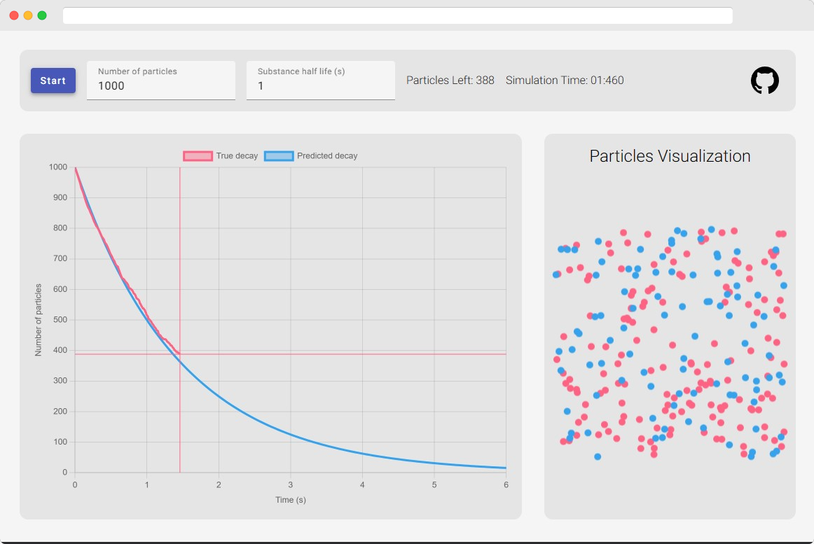

# Radioactive Decay Web

Radioactive Decay Web is a simple Web-Based radioactive decay simulator made to showcase the randomness of this process.
You can access it [here](https://stopnoanime.github.io/radioactive-decay-web/).

It is made using Angular and [ng2-charts](https://github.com/valor-software/ng2-charts).
Simulation code was inspired by [this](https://scipython.com/book2/chapter-6-numpy/examples/simulating-radioactive-decay/) site.